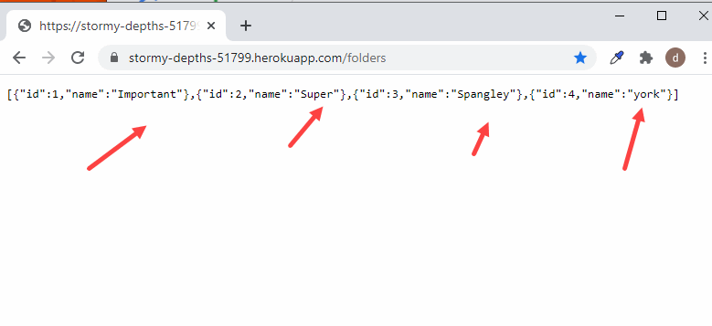
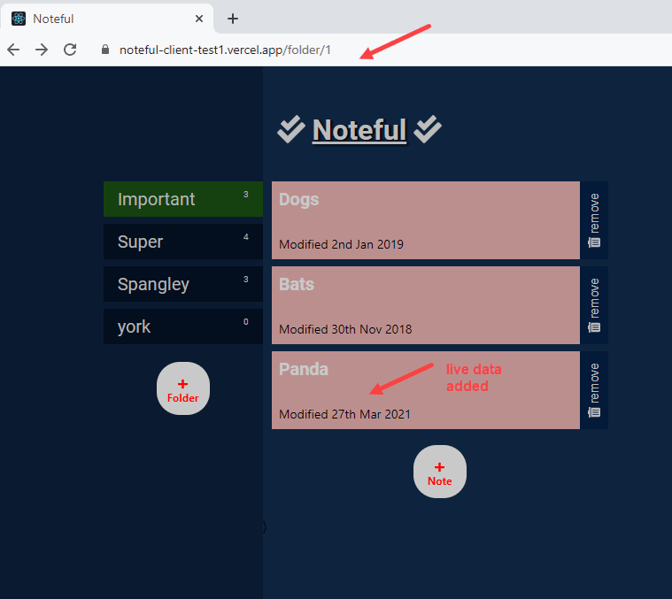

## >> Project Name:

Noteful-API--Heroku

## >> Project Summary:

This assignment converts local version of Noteful server [Noteful-Server--Express-PostgreSQL](https://github.com/davetam88/Noteful-Server--Express-PostgreSQL) and deploy it to Heroku server so that the database content can be exposed via a set of API interfaces.This Server API APP is live at : 

[Noteful-API--Heroku - Live link](https://stormy-depths-51799.herokuapp.com/)


The Server APP use PostgreSQL database engine to supplies these APIs.

These API was used by the online version of the Noteful Client [Noteful-Client--React-Router](https://github.com/davetam88/Noteful-Client--React-Router) to emulate a Note management APP. This client app is live at :

[Noteful-Client--React-Router - live link](https://noteful-client-test1.vercel.app/)

Integrated test was developed in tandem with API code development by using Mocha(a testing framework), Chai(an assertion library), and Supertest(a tool for testing HTTP calls) to ensure maximum code reliability.

## >> Database

Database noteful and noteful-test were used; noteful_folders and noteful_notes are the database tables.

## >> Supported endpoints(and how the noteful client APP access to these endpoints)
```
> GET /folders = read all the folders in the database
  Access at APP startup

> GET /notes = read all the notes in the database
  Access at APP startup

> POST /folders = create a new noteful folder
  Access with the add folder button of the client app

> POST /notes = create a new noteful note
  Access with the add folder button of the client app

> DELETE /note/id = to delete an individual noteful note
  Access with the delete note button next to the note
```

## >> Screenshots

* Noteful API Server APP - main screen (deploy with Heroku), it is accessing the same folder page data as the client APP shown below using the /folders endpoint API.




* Noteful Client APP - main screen (deploy with Vercel)




## >> Technologies used in this APP:

* Heroku Server
* Express framework - for building Node web APIs.
* morgan - HTTP request logger.
* Express middleware
* API tokens
* Authorization headers
* CORS - an Express middleware, it simplifies the configuration of CORS in Express.
* Helmet
* Supertest library - 

-> Javascript: ES6

-> Tools
* Postman
* VSC Debugger
* nodemon 
* NPM
* Dbeaver
* morgan loggging tool


# Express Boilerplate! 

This is a boilerplate project used for starting new projects!

## Set up 

Complete the following steps to start a new project (NEW-PROJECT-NAME):

1. Clone this repository to your local machine 
   git clone BOILERPLATE-URL NEW-PROJECTS-NAME
2. `cd` into the cloned repository
3. Make a fresh start of the git history for this project with 
   rm -rf .git && git init
4. Install the node dependencies 
   npm install
5. Move the example Environment file to `.env` that will be ignored by git and read by the express server 
   mv example.env .env
6. Edit the contents of the `package.json` to use NEW-PROJECT-NAME instead of `"name": "express-boilerplate",`

## Scripts

Start the application 
  npm start

Start nodemon for the application 
  npm run dev

Run the tests 
  npm test

## Deploying

When your new project is ready for deployment, add a new Heroku application with 
  Heroku create
This will make a new git remote called "Heroku" and you can then 
  npm run deploy
which will push to this remote's main branch.


